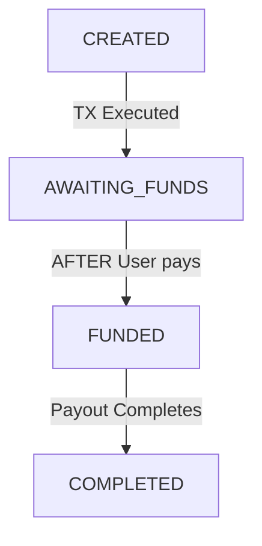

# Basic React Portfolio

# MERMAID

## Standard User Funded pay in transaction

## Run Locally

- Run `npm install`

- In a seperate terminal, in the `testing/` directory, run `json-server --watch db.json`

- Back in the original terminal run: `npm start` or `yarn start` to build and watch

- Open http://localhost:8080 to view it in the browser.

## Available Scripts

### npm start

Runs the app in the development mode.
Open http://localhost:8080 to view it in the browser.

In a seperate terminal, in the `testing` directory, run `json-server --watch db.json`

### npm test

Launches the test runner in the interactive watch mode.
See the section about running tests for more information.

### npm run build

Builds the app for production to the `dist/` folder.
It correctly bundles React in production mode and optimizes the build for the best performance.
